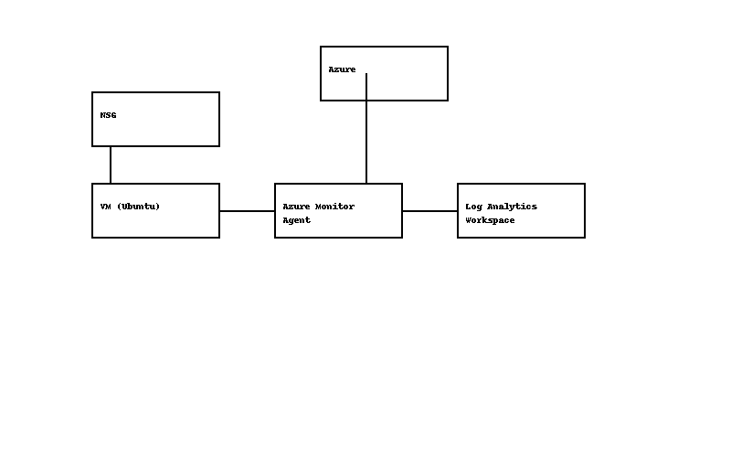

# Azure Log Monitoring & Security Automation (Azure Monitor + Log Analytics + Terraform + Python)

This project demonstrates how to build a real-world Azure log monitoring and security visibility solution using:

- **Azure Monitor Agent (AMA)**
- **Log Analytics Workspace**
- **Linux VM diagnostic collection**
- **Terraform IaC deployment**
- **Python-based log query & alerting automation**
- **Azure-native monitoring & governance controls**

The solution mirrors how enterprises collect, centralize, and analyze OS-level logs to support security operations, compliance visibility, threat detection, and infrastructure monitoring.

---

## 📌 Project Overview

This project provisions a monitored Ubuntu VM, attaches the Azure Monitor Agent, connects it to a Log Analytics Workspace, and enables log collection and queries for operational & security insights.

You also implement Python automation to query logs and produce alert notifications (email-capable version included).

This project is ideal for:

- Cloud Security Architecture  
- Azure Monitoring Engineering  
- Log Analytics / KQL learning  
- DevSecOps / Operations visibility  
- Compliance-driven monitoring (ISO, SOC2, NIST, PCI)

---

## 🏗 Architecture Diagram



### How It Works
1. The **Ubuntu VM** runs system services and produces Syslog + performance data.  
2. The **Azure Monitor Agent (AMA)** collects logs and metrics.  
3. Logs flow into the **Log Analytics Workspace** for indexing, KQL queries, and alert rules.  
4. Python scripts use the **Azure Monitor Query SDK** to pull logs and optionally trigger email alerts.  
5. Terraform provisions and configures all dependencies, creating a repeatable IaC deployment.

---

## 🧩 Technologies Used

See [technologies.md](./technologies.md) for full explanations.

Key components include:

- Azure Monitor Agent (AMA)
- Log Analytics Workspace
- Diagnostic Settings
- Azure Resource Manager (ARM)
- Terraform (IaC)
- Azure Monitor Query (Python SDK)
- KQL (Kusto Query Language)

---

## 🚀 Deployment Overview (Terraform)

Terraform deploys:

- Resource Group  
- Ubuntu VM  
- Virtual Network, Subnet, NSG  
- Public IP + NIC  
- Azure Monitor Agent extension  
- Log Analytics Workspace  
- Diagnostic & metric collection rules  
- Output variables for connectivity + workspace IDs  

Files:

- `main.tf` – full infrastructure  
- `variables.tf` – input definitions  
- `outputs.tf` – workspace + VM outputs  

Note:  
`terraform.tfvars`, `terraform.tfstate`, and Terraform binary files are intentionally excluded from the repo.

---

## 📝 Log Collection & Monitoring

Logs collected:

- Syslog (`auth`, `kern`, `syslog`, etc.)  
- Performance counters  
- Basic OS metrics (CPU/memory/disk/network)

Diagnostic settings configured through Terraform send platform logs to the workspace.

---

## 🕵️ Python-Based Log Querying & Alerts

Two automation scripts are included:

### `query_logs.py`
Queries Log Analytics using the Azure Monitor SDK:

- Retrieves logs via KQL  
- Prints recent log events  
- Used for validating AMA ingestion and troubleshooting

### `query_logs_email_alert.py`
Enhanced script with alert capabilities:

- Runs a KQL query  
- Checks for matching events  
- Triggers an email alert (via SMTP or integration)

This demonstrates SOC-style automation patterns.

---

## 🔐 Security Requirements

See: [security_requirements.md](./security_requirements.md)

Highlights:

- NSG restricts SSH to a single allowed IP  
- Admin credentials securely stored outside GitHub  
- Terraform state and `.tfvars` excluded  
- IAM uses least privilege access  
- Log ingestion and audit visibility mapped to compliance frameworks

---

## 📊 Compliance Mapping

See: [compliance_mapping.md](./compliance_mapping.md)

Frameworks covered:

- ISO 27001  
- CIS Azure Foundations  
- NIST 800-53  
- PCI DSS Logging Requirements

---

## 🛠 Linux Commands Used

See: [linux_commands.md](./linux_commands.md)

Includes:

- Azure CLI commands  
- Linux package installs  
- AMA validation steps  
- KQL testing commands

---

## 🧹 Teardown Procedure

See: [teardown.md](./teardown.md)

Includes:

- Terraform destroy  
- Manual cleanup checks  
- Workspace retention considerations

---

## 📘 Lessons Learned

See: [lessonslearned.md](./lessonslearned.md)

Topics:

- AMA vs OMS (legacy)  
- Ubuntu 24.04 extension compatibility  
- Diagnostic settings nuances  
- Networking requirements  
- Importance of excluding secrets (tfvars)  

---

## 📦 Repository Structure

```
README.md
azure_architecture_diagram.png
compliance_mapping.md
lessonslearned.md
linux_commands.md
main.tf
outputs.tf
query_logs.py
query_logs_email_alert.py
risks_and_mitigations.md
security_requirements.md
technology.md
teardown.md
variables.tf
```

Excluded correctly:

```
terraform.tfvars
terraform.tfstate
terraform binary
```

---

## 📚 Next Enhancements (Optional)

- Add Azure Monitor Alert Rule (Terraform)
- Add Logic App SMS/Email alerting
- Build a Log Analytics Dashboard
- Integrate with Microsoft Sentinel

---

